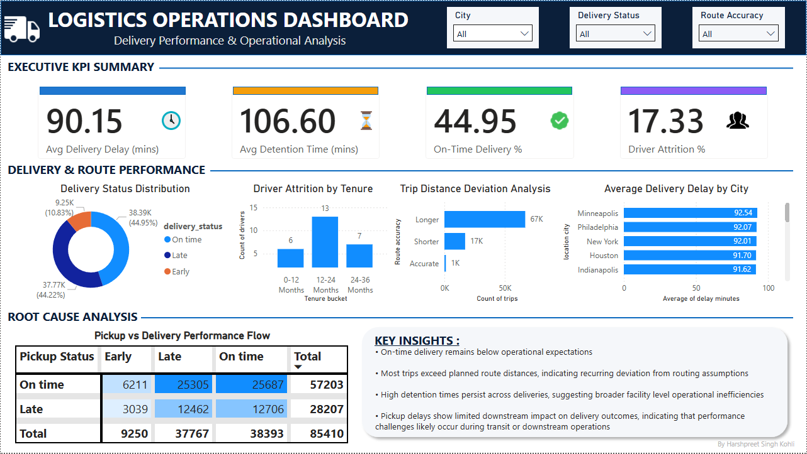

# Logistics Operations Analysis

## Project Overview

This project analyzes logistics operations data to identify inefficiencies in delivery performance, route planning, driver retention, and operational delays. The analysis was conducted using SQL for data exploration and KPI development, followed by Power BI for dashboard design and business storytelling.

The objective was to transform raw operational data into actionable business insights that support operational decision-making and improve logistics performance.

---

## Business Objective

The primary objective of this project was to evaluate operational performance across the logistics network and identify key factors affecting:

- Delivery performance
- Route efficiency
- Driver retention
- Operational bottlenecks
- Facility-level delays

The project focuses on uncovering insights that can help improve service reliability and operational efficiency.

---

## Tools & Technologies

- MySQL
- SQL
- Power BI
- Data Analysis
- Business Intelligence
- Data Visualization

---

## Dataset Overview

The analysis was performed using multiple operational datasets:

### Trips
Contains trip-level operational data such as:
- Trip ID
- Driver ID
- Truck ID
- Distance traveled
- Duration

### Loads
Contains shipment and revenue-related information.

### Routes
Contains planned route information including:
- Typical distance
- Expected transit time

### Delivery Events
Contains pickup and delivery timestamps, detention times, and delivery performance indicators.

### Drivers
Contains driver information including:
- Employment status
- Experience
- Hire date
- Termination date

### Trucks
Contains fleet-related information.

---

## Analysis Performed

### 1. Driver Attrition Analysis

- Calculated overall driver attrition rate
- Evaluated tenure of terminated drivers
- Categorized drivers into tenure buckets
- Identified retention patterns across employment duration

### 2. Route Performance Analysis

- Compared actual distance traveled against planned route distance
- Calculated route deviation metrics
- Classified trips as:
  - Longer than Expected
  - Shorter than Expected
  - Accurate Route

### 3. Transit Duration Analysis

- Compared actual trip duration with expected transit time
- Applied a ±12-hour tolerance window for realistic performance evaluation
- Assessed planning accuracy of expected transit durations

### 4. Delivery Performance Analysis

- Calculated on-time delivery rate
- Measured delivery delays
- Analyzed detention times
- Categorized deliveries as:
  - On Time
  - Late
  - Early

### 5. Root Cause Analysis

- Compared pickup performance against delivery performance
- Evaluated delay propagation across logistics operations
- Assessed whether pickup delays significantly impacted final delivery outcomes

---

## Key Findings

### Delivery Performance

- On-time delivery rate was **44.95%**, indicating that more than half of deliveries did not meet scheduled timelines.
- Average delivery delay was approximately **90 minutes**.

### Route Efficiency

- **67,029 trips** exceeded expected route distances.
- Average positive route deviation was approximately **55.9 miles**.
- Results suggest recurring deviation from route planning assumptions.

### Operational Delays

- Average detention time was approximately **106 minutes**.
- Detention times remained consistently high across all delivery categories.
- Findings indicate broader facility-level operational inefficiencies.

### Driver Attrition

- Driver attrition rate was **17.33%**.
- Highest attrition occurred within the **12–24 month tenure group**.
- Results suggest a mid-term retention challenge rather than an onboarding issue.

### Pickup vs Delivery Performance

- Pickup delays showed limited downstream impact on final delivery outcomes.
- Delivery performance remained largely consistent regardless of pickup status.
- Findings suggest that performance challenges are more likely occurring during transit or downstream operations.

---

## Dashboard Components

The Power BI dashboard was designed to provide an executive-level view of logistics performance through:

### Executive KPI Summary
- Average Delivery Delay
- Average Detention Time
- On-Time Delivery Rate
- Driver Attrition Rate

### Delivery & Route Performance
- Delivery Status Distribution
- Driver Attrition by Tenure
- Route Distance Deviation Analysis
- Average Delivery Delay by City

### Root Cause Analysis
- Pickup vs Delivery Performance Flow
- Executive Insights Summary

---

## Business Recommendations

Based on the analysis, the following recommendations were identified:

1. Review route planning assumptions to reduce recurring route deviations.
2. Investigate facility-level processes contributing to high detention times.
3. Improve delivery scheduling and operational monitoring to increase on-time delivery performance.
4. Focus operational improvement efforts on transit-stage processes rather than pickup-stage performance.
5. Develop targeted retention initiatives for drivers in the 12–24 month tenure range.

---

## Dashboard Preview

Insert dashboard screenshot below:

---

## Project Outcome

This project demonstrates the complete analytics workflow:

- Business problem definition
- Data exploration using SQL
- KPI development
- Root cause analysis
- Data visualization using Power BI
- Executive-level business storytelling

The final outcome is an interactive dashboard that provides actionable insights into logistics operations and delivery performance.

---

## Author

**Harshpreet Singh Kohli**

SQL | Power BI | Business Analytics | Operations Analytics
